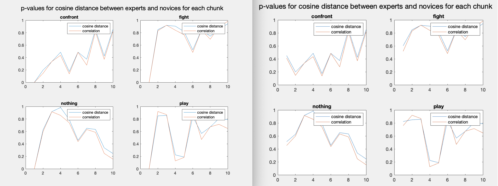

# cctv-eyetracking-analysis

# Background

This project is from the follow-up research on https://github.com/chsoo92/cctv-eyetracking-analysis/blob/master/VSS16Poster_Joseph.pdf

Previous experiments obtained CCTV eye-tracking data of 4 action categories (confront, play, nothing, and fight) from novices and experts. There were 9 videos for each circumstance; each video is 40 frames long. According to Itti's saliency model for the fixation area in the videos, novices and experts showed a marginally significant difference on the saliency of their looking area near the end of videos (last 2 seconds among the entire 16 s), averaging across 4 video categories. The effect was marginally significant for both 38 pixel diameter (p = 0.092) and 75 pixel diameter (p = 0.076). Experts got higher saliency indices than novices. By looking at the four action categories separately, there was no significant difference between experts and novices.

Deep Learning Decoding

The eye=tracking data were fed into to a deep learning model (AlexNet), and high-level features from the deep fully-connected layer (fc7) were extracted. However, logistic regression of action category on the extracted feature (elastic net regularization), showed that only the fighting category yielded a significantly accurate result (M = 0.68, p = 0.006). Interestingly, the last chunk from the fighting videos had a disproportional influence on the classification.

The goals of this data analysis:
> 1. Explore which frames of the videos are similarly represented in the deep layer, across different categories and groups. 2. Explore how different frame groupings influence intergroup/category similarity. 3. How and where expert and novice data are different from one another

# Data

Since 'fea_fc7_all_v3' is a 21x4096x40x36 multidimensional array, it is too heavy to be uploaded here.
http://naver.me/FwwAeBFe
> 21 participants(10 novices and 11 experts).
>36 videos (4 action categories, 9 videos for each category).
>Each video consists of 40 frames.
>For each frame, the extracted features are represented as a 1 x 4096 vector.

There are three main frame groupings:individual frame, cumulative (1~x), and chunking (1 chunk = 4 frames) (chunk and cumlative groupings are either concatenated or averaged).

Correlation and cosine distance of the deep layer features across participant groups quantify similarity.
For example, 
> group: experts. grouping: concatenated chunk (1-4). action: fighting. Each feature (1x4096) is concatenated such that the chunk for each expert is a 1x16384 vector. Then, get correlation matrix or cosine distance matrix across 11 experts (11x11 matrix). The mean of such matrix represents correlation or cosine distance for the 1-4 frame chunk.

# Result

Initial analysis results are illustrated in summary2.pdf and summary3.pdf. The initial analysis results are messy and hard to generalize. However, one pattern robust thoroughout the different analysis was that features from the early part of the videos are highly similar across different groups and action categories

As shown in the above graph, the first frame are the most correlated out of 40 frames. similar across experts and novices. In other words, whether noivce or expert, participants' eye-tracking data are similar in the early portion of the videos. This bias is due to screen center bias:people tend to stare at the center of a screen when a video starts (https://www.sciencedirect.com/science/article/pii/S0042698910004025).

To minimize the screen center bias in the early portion of the vidoes, more analyses were done excluding frames 1 to 4. 

figure 1

figure 2

figure 3

I removed the first 4 frames and obtained a new figure of the frames with the highest correlation (figure 1). The red bars indicate that the frames with the highest correlation differ by more than 2 frames between experts and novices. The blue bars signify otherwise (less than or equal to 2 frame difference). So each red bar signifies that frames with the highest correlation differ between experts and novices. 

Also, I removed the first chunk in the chunking method. In figure 2, the right graph is the original p-value graph with all the chunks. The left graph is for the first chunk removed. p-values in both graphs are identical except at the first chunk, as the values for the removed first chunk are 0.

Figure 3 compares the original chunk index graph (right) with the new one with the first chunk removed (left). For the chunking method, the red bars indicate that the chunks with the highest correlation are not identical between experts and novices. The blue bars indicate that the chunks with the highest correlation are identical between experts and novices.

